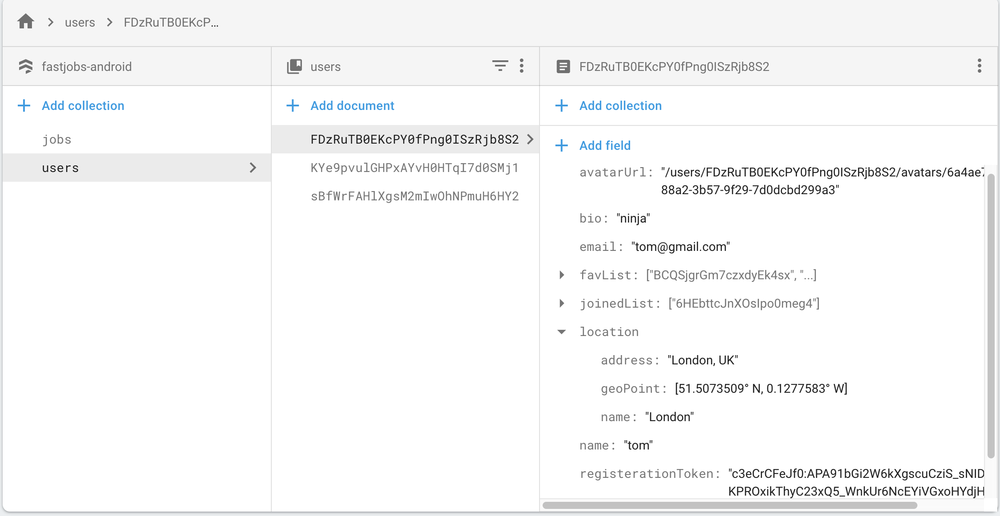
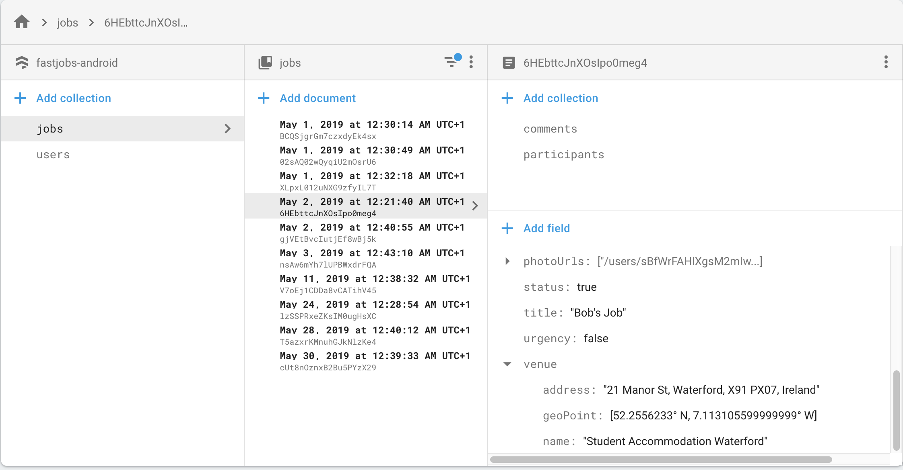

# Mobile App Development

Name: Rudine Surya Hartanto

GitHub: https://github.com/rudinesurya/FastJobs-Android

Demo Video: https://www.youtube.com/watch?v=OeL6AN7Wkzc

## Table of Contents

+ [Overview](#Overview)
  + [App Concept](#App-Concept)
  + [Objectives](#Objectives)
  + [Personal Statement](#Personal-Statement)
  + [Business Case](#Business-Case)
  + [Future Development and Possibilities](#Future-Development-and-Possibilities)

+ [Installation Requirements](#Installation-Requirements)

+ [Features](#Features)
  + [UI Design](#UI-Design)
  + [Validation](#Validation)
  + [Authentication](#Authentication)
  + [Receiving Notifications](#Receiving-Notifications)
  + [Integration With Android Ecosystem](#Integration-With-Android-Ecosystem)
  

+ [Development Features](#Development-Features)
  + [Optimizations](#Optimizations)
  + [MVVM Architecture Adopted](#MVVM-Architecture-Adopted)
  + [Git Approach Adopted](#Git-approach-adopted)
  + [Complex Model Schema](#Complex-Model-Schema)
  + [Third Party Components](#Third-party-components)
  + [Third Party Api](#Third-party-Api)
  + [Folder Structure](#Folder-Structure)
  + [Dependency Injection](#Dependency-Injection)
  + [Testings](#Testings)
    + [Unit Tests](#Unit-Tests)
    + [Instrumentation Tests](#Instrumentation-Tests)

+ [References](#References)


# Overview
### App Concept
This is an app for quick contract job, similar to the likes of Meetup.
It has some form of social networking feature, eg. the ability to view user's profile and chat


### Objectives
+ For the host: Enable quick solution for finding adhoc work done.
+ For the jobseeker: Enable checking out the job details and payment before joining.

### Personal Statement
This App has taken some inspirations from meetup (https://www.meetup.com/) and airbnb (https://www.airbnb.ie). This is also my first large scale android development project with many experimentation with new libraries and kotlin language.

### Business Case
The usage of the App is not limited to employer only. Anyone can create a job such like a landlord can put his property for rent. The company could use a profit sharing business model, in exchange the user gain the platform. All the marketting and promoting will be done by the company.

### Future Development and Possibilities
At the current state, due to lack of time, some of the implementation and design pattern were rushed. This makes automated testings and maintainence difficult. Also, I am storing duplicate data in Firestore for most of the document referencing. It can be improved further by either storing user doc reference (Not sure if it might double the query), or by having a cloud function which periodically aggregate the data to sync. 
 
# Installation Requirements
Must provide your own google-services.json with valid api key

Recommended version of android is Oreo


# Features
+ CRUD operation with cloud persistence (Firestore)
+ List Jobs (Sorting, Filtering)
+ Dynamic map view with gps (view nearby jobs and also places of interests)
+ View & Edit Job Detail (with authentication)
+ Chat system in the job page
+ Push notification sent to participants (when job cancelled/resumed)
+ Login / Register
+ View other user's profile
+ Edit self user profile
+ Join / Leave Job
+ Custom Notifications

### UI Design

Clean Design Concept
+ Use action bar and navigation drawer to place menu items instead of cluttering them on the activity fragment.
+ Sensible navigation and deep linking.
+ For more important features, allow multiple way to access it besides a button. (nav drawer)
+ User can sign out from anywhere in the app. (nav drawer)
+ Async loading enables seamless and smooth experience for the user.
+ Show loading bars when possible.

Adherence to the Android Material Design
+ CoordinatorLayout extends the ability to accomplish many of the Google's Material Design scrolling effects.
+ parallax scrolling effects animations for the action bars during scrolling effect.
+ expanding and collapsing action bar allows more screen real estate for displaying more important stuffs.


 ### Validation
 
 
 Show error messages to user in the form and also show toast message when something significant happens (eg. new entry to db / error)


 ### Authentication
 

 Uses Firebase Authentication to enable simple user registeration and logging in, and also enable google authentication.


 ### Receiving Notifications
 

Uses cloud function event trigger to send notifications to devices. 
+ Notifications can be sent to topic, where only subscribed users will receive.
+ Notifications can also be sent to specific tokens. This is used when the notification only concern certain group of users.


### Integration With Android Ecosystem
+ Static maps can launch an intent to open the user's Google Maps.
+ Clicking on the job date will prompt user if he/she wants to add the job detail to the Google Calendar.
+ Other usage of intent filter for sharing job to (gmail,facebook,whatsap, other social media)


# Development Features

### Optimizations 
+ Using best practices for relationship database design
+ Usage of sub-collection within documents to optimize read
+ Usage of cross referencing with key ids to avoids multiple querying for specific results
+ Having a special class to cache common documents.

The store class is created to reduce calls to firestore for fetching the same data multiple times due to many screens sharing the same data. We reduced the number of calls from one call per activity/fragment to a single call throughout the whole app. There is no reason to constantly request for data as we are using listener and will receive live update from the database.
```
/***
 * Class used to hold references to common objects to avoid multiple querying of the same data
 */
class Store(private val repository: MyRepository) {
    // LiveData
    private val _jobs = MutableLiveData<List<Job>>()
    val jobs: LiveData<List<Job>?>
        get() = _jobs

    ...

    init {
        fetchAllJobs()
    }

    fun fetchAllJobs() {
        Timber.d("fetching All Jobs")
        repository.getAllJobsLiveData {
            it.observeForever {
                _jobs.postValue(it.data)
            }
        }
    }
}
```

### MVVM Architecture Adopted
Architecture components help you structure your app in a way that is robust, testable, and maintainable with less boilerplate code.

This diagram shows a basic form of this architecture:


#### View: 
The view role in this pattern is to observe (or subscribe to) a ViewModel observable to get data in order to update UI elements accordingly.

#### ViewModel: 
ViewModel interacts with model and also prepares observable(s) that can be observed by a View. Acts as a communication center between the Repository and the UI. Hides where the data originates from the UI. ViewModel instances survive Activity/Fragment recreation.


#### Model: 
Model represents the data and business logic of the app. One of the recommended implementation strategies of this layer, is to expose its data through observables to be decoupled completely from ViewModel or any other observer/consumer.

The following diagram shows MVVM components and basic interactions.


#### LiveData: 
A data holder class that can be observed. The UI that is observing the livedata will react when data changes. This allows the components in your app to be able to observe LiveData objects for changes without creating explicit and rigid dependency paths between them. LiveData respects Android Lifecycle and will not invoke its observer callback unless the LiveData host (activity or fragment) is in an active state. Adding to this, LiveData will also automatically remove the observer when the its host receives onDestroy().


#### Repository: 
A Repository class abstracts access to multiple data sources.

#### DAO: 
Data access object. Interface between Repository and the database.

#### Firestore: 
cloud persistence database which also supports caching for offline data.

#### Remote Data Source: 
For making REST API requests to the web.


### Advantages of MVVM with Clean Architecture
+ MVVM separates your view (i.e. Activities and Fragments) from your business logic.
+ Your code is further decoupled.
+ The package structure gets easier to navigate.
+ The project is easier to maintain.
+ Your team can add new features more quickly.

### Git Approach Adopted

### Complex Model Schema
User entity holds its own references to jobs that he/she has joined. This enables fast querying in the job dashboard, when we want to filter jobs that the current user has joined or has saved as favourite.


Job entity creates sub-collection to hold users that have joined and another collection for holding all the comments. This strategy can further be improved for large data as we can query sub-collection by pages. The advantage of not storing all these references in the job entity itself is that we dont bloat up the job entity size by irrelevant data. We also avoid hitting the size limit per document.


### Third Party Components
+ Latest Android Architecture and Support Libraries
  + android arch
  + android jetpack
  + android ktx
  + kotlin coroutines
  + Room

+ Logging Support
  + timber (for logging)

+ Firebase Support
  + Firestore
  + Firebase Authentication
  + Firebase Storage
  + FirestoreLiveData

+ UI Enhancement Components
  + google maps
  + places-autocomplete
  + glide
  + date-time-picker
  + epoxy recyclerview
  + spots-dialog

+ Code Enhancement Components
  + retrofit
  + kodein
  + junit4
  + espresso
  + mockk
  + assertj

### Third Party Api

+ Google Maps
+ Google Places
+ Google Autocomplete
+ GPS
+ Firebase Firestore
+ Firebase Authentication
+ Firebase Messaging
+ Firebase cloud function


Google Maps, GPS, together with Google Places API are used for making REST requests with retrofit to get a list of nearby places of interest to display on the dynamic map view activity. 

Firebase cloud function is used as event trigger for when a job gets cancelled or resumed by host. It will then notify all participants involved. 

```
exports.notifyJobCancelled = functions.firestore
  .document('jobs/{id}')
  .onUpdate((change, context) => {
    const after = change.after.data();
    const jobId = context.params.id;
    
    // Creates the notification payload
    admin.firestore()
      .collection('jobs')
      .doc(jobId)
      .collection('participants')
      .get()
      .then(snapshot => {
        const notificationBody = after.status ? 'Host resumed the job' : 'Host cancelled the job';
        const payload = {
          notification: {
            title: 'FastJobs alert',
            body: notificationBody,
            clickAction: 'JobDetailActivity',
          },
        };

        // Send this notification to every registered tokens
        snapshot.forEach(user => {
          console.log(`userId ${user.id}`)
          admin.firestore()
            .collection('users')
            .doc(user.id)
            .get()
            .then(user => {
              const token = user.data().registerationToken
              admin.messaging().sendToDevice(token, payload);
            })
            .catch(err => console.log(err));
        });
      })
      .catch(err => console.log(err));
  });
```

### Dependency Injection
Dependency injection is an instrumental technique, used to decouple dependencies from the code.

#### Make our application KodeinAware
To provide dependencies to other classes, we need to supply kodein all the dependencies, usually done in the Application class as there will only be one instance of that class and it does not have a lifecycle. 
```
class MyApplication : Application(), KodeinAware {
    override val kodein = Kodein.lazy {
        import(androidXModule(this@MyApplication))

        bind() from singleton { FirebaseFirestore.getInstance() }
        bind() from singleton { JobDao(instance()) }
        bind() from singleton { MyRepository(instance(), instance(), instance(), instance()) }
        bind() from provider { ViewModelFactory(instance(), instance(), instance(), instance()) }
        ...
    }
}
```

To enable the dependencies to be passed, we need our classes to implement KodeinAware interface. This gives us an advantage of maintaining clean code and reduce lots of boilerplate due to passing references between classes.
```
class JobListFragment : KodeinAware {
    override val kodein: Kodein by closestKodein()
    private val viewModelFactory: ViewModelFactory by instance() // Get access to the view model factory
    private val auth: Auth by instance() // Get access to the auth class

    ...

    override fun onViewCreated(view: View, savedInstanceState: Bundle?) {
        super.onViewCreated(view, savedInstanceState)
        viewModel = ViewModelProviders.of(this, viewModelFactory)
            .get(JobListViewModel::class.java)

        ...
    }
}
```

### Testings
#### Unit Tests
+ Testing of Model data classes

#### Instrumentation Tests
+ Testing of network rest api services
+ Testing of Data Access Object (DAO)


# References

https://github.com/airbnb/epoxy/wiki/Kotlin-Model-Examples

https://codelabs.developers.google.com/codelabs/android-room-with-a-view-kotlin/#0

https://www.toptal.com/android/android-apps-mvvm-with-clean-architecture

https://medium.com/@saquib3705/consuming-rest-api-using-retrofit-library-with-the-help-of-mvvm-dagger-livedata-and-rxjava2-in-67aebefe031d

https://proandroiddev.com/mvvm-architecture-viewmodel-and-livedata-part-1-604f50cda1

http://kodein.org/Kodein-DI/

https://proandroiddev.com/dependency-injection-with-kotlin-kodein-koin-3d783745e48d

https://github.com/umangburman/Navigation-Drawer-With-Navigation-Component

https://www.lordcodes.com/posts/testing-on-android-using-junit-5

https://mockk.io/

https://www.youtube.com/watch?v=RX_g65J14H0

https://firebase.googleblog.com/2017/12/using-android-architecture-components.html

https://material.io/develop/android/

https://developers.google.com/places/android-sdk/start

https://developers.google.com/maps/documentation/urls/android-intents

https://www.raywenderlich.com/230-introduction-to-google-maps-api-for-android-with-kotlin

https://guides.codepath.com/android/Handling-Scrolls-with-CoordinatorLayout