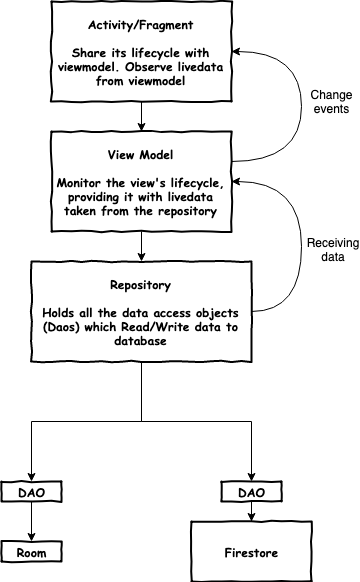

# Mobile App Development

Name: Rudine Surya Hartanto

## Overview

##### App Concept:
This is an app for quick contract job, similar to the likes of Meetup.
It has some form of social networking feature, eg. the ability to view user's profile and chat

##### Objectives:
+ For the host: Enable quick solution for finding adhoc work done.
+ For the jobseeker: Enable checking out the job details and payment before joining.
 

##### Features:
 + CRUD operation
 + List Jobs (Sorting, Filtering)
 + View & Edit Job Detail
 + Chat system in the job page
 + Login / Register
 + View other user's profile
 + Edit self user profile
 + Join / Leave Job

## Installation requirements

Must create a resource file (google_maps_api.xml) inside src/debug/res/values and src/release/res/values
<resources>
    <string name="google_maps_key" templateMergeStrategy="preserve" translatable="false">YOUR_KEY</string>
</resources>

## UI Design

Clean Design Concept
+ Use action bar and navigation drawer to place menu items instead of cluttering them on the activity/fragment.
+ Sensible navigation and deep linking.
+ For more important features, allow multiple way to access it besides a button. (nav drawer)
+ User can sign out from anywhere in the app. (nav drawer)
+ Async loading enables seamless and smooth experience for the user.
+ Show loading bars when possible.

Adherence to the Android Material Design
+ CoordinatorLayout extends the ability to accomplish many of the Google's Material Design scrolling effects.
+ parallax scrolling effects animations for the action bars during scrolling effect.
+ expanding and collapsing action bar allows more screen real estate for displaying more important stuffs.

## Integration with Android ecosystem

+ Static maps can launch an intent to open the user's Google Maps.
+ Clicking on the job date will prompt user if he/she wants to add the job detail to the Google Calendar.

## Third party web api

Google Places API is used for making REST requests with retrofit to get a list of nearby places of interest to display on the job detail page as recommendation.

## Unit Testing and Instrumentation Testing

UI Layer
+ Testing of ...

Model Layer
+ Testing of Model data classes

Database Layer
+ Testing of Data Access Object (DAO)
+ Testing of network rest api services
+ Testing of firebase & firestore
+ Testing of Room

## Model View ViewModel(MVVM) with Clean Architecture

Architecture components help you structure your app in a way that is robust, testable, and maintainable with less boilerplate code.

This diagram shows a basic form of this architecture:

#### LiveData: A data holder class that can be observed. The UI that is observing the livedata will react when data changes.

#### ViewModel: Provides data to the UI. Acts as a communication center between the Repository and the UI. Hides where the data originates from the UI. ViewModel instances survive Activity/Fragment recreation.

#### Repository: A Repository class abstracts access to multiple data sources.

#### DAO: Data access object. Interface between Repository and the database.

#### Firestore: cloud persistence database which also supports caching for offline data.

#### Remote Data Source: For making REST API requests to the web.

#### Model: The model data class.

### Advantages of MVVM with Clean Architecture
+ MVVM separates your view (i.e. Activities and Fragments) from your business logic.
+ Your code is further decoupled.
+ The package structure gets easier to navigate.
+ The project is easier to maintain.
+ Your team can add new features more quickly.

## Third party libraries

+ android arch
+ android jetpack
+ android ktx
+ kotlin coroutines
+ timber (for logging)
+ firebase
+ firebase storage
+ firestore
+ google-map
+ places-autocomplete
+ retrofit
+ glide
+ date-time-picker
+ epoxy recyclerview
+ kodein
+ junit4
+ assertj

## References

